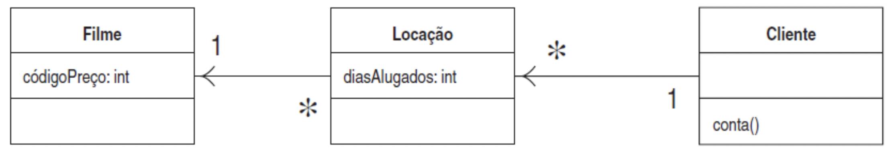
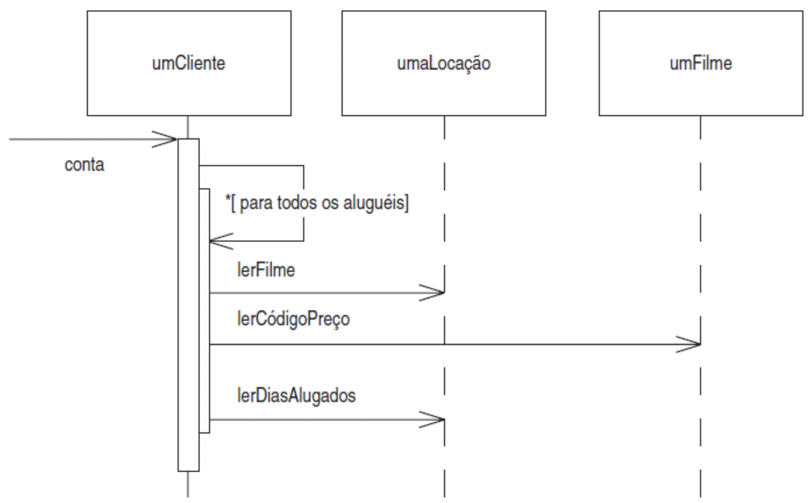
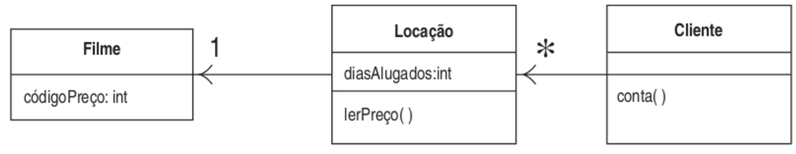
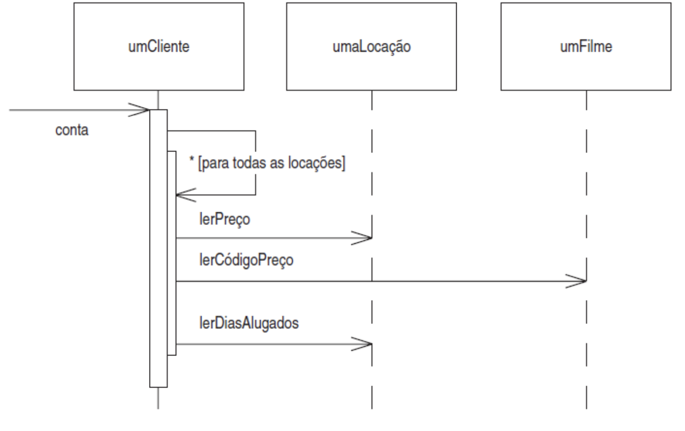
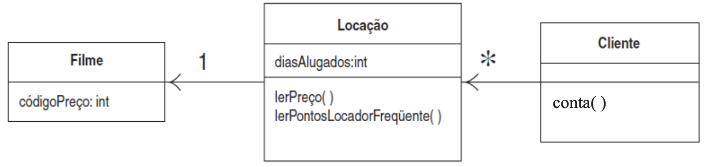
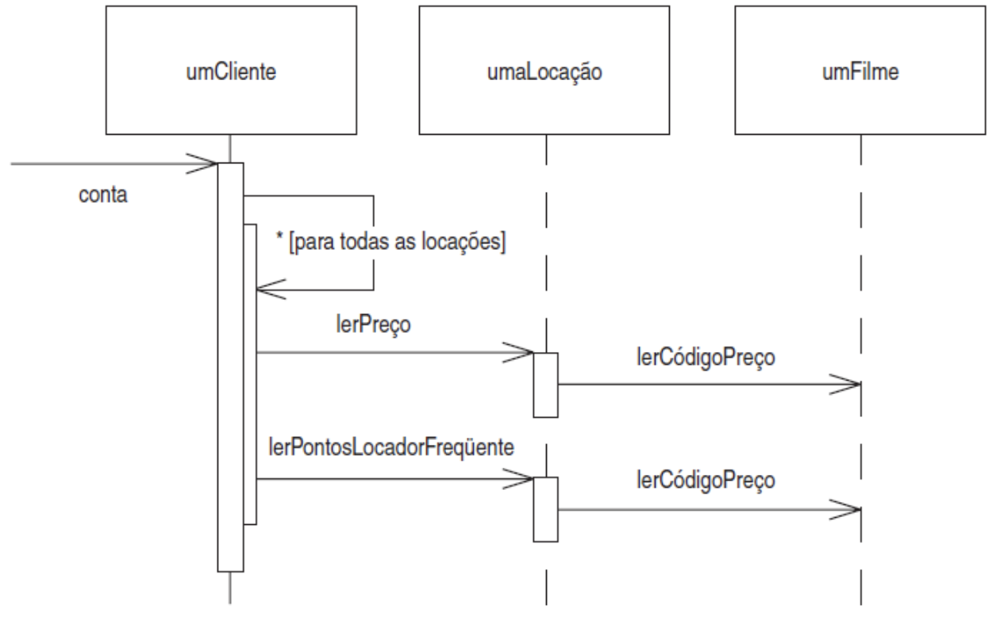
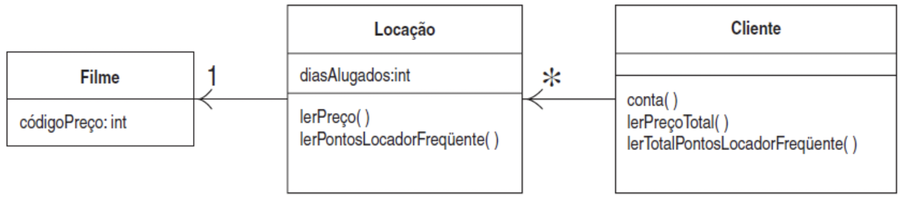
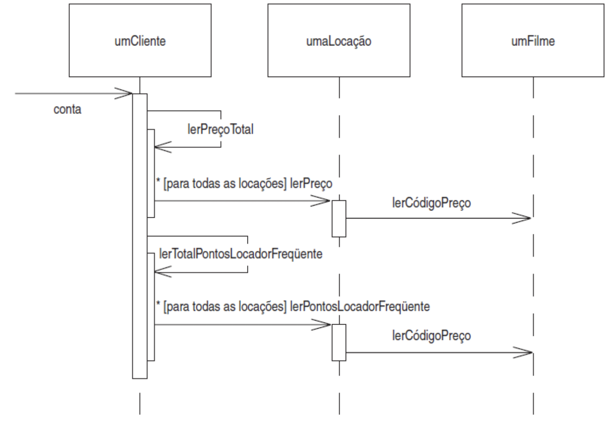
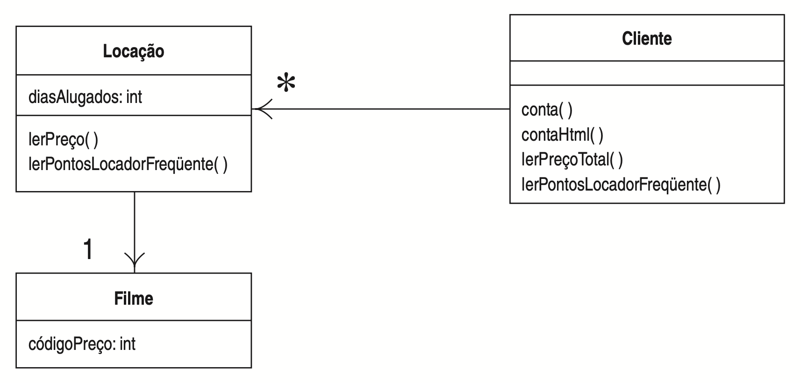
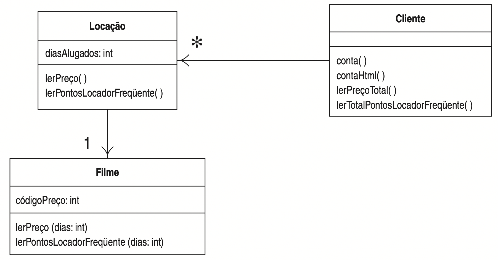

# Refactoring hands-on

Repository with source code of examples used in the refactoring hands-on taught by Rodrigo Martins Pagliares at UNIFAL-MG.

## 01 - refactoring-hands-on

First version of the example to be evolved during the hands-on. Although fully functional, this version has a very poor object oriented design.

### UML Class Diagram:

    

### UML Sequence Diagram:

    

## 02 - refactoring-hands-on

Second version of the example. This version builds upon the first version by applying the refactoring Extract Method (creation of the method quantiaDe(Locacao umaLocacao) from the method conta()).

## 03 - refactoring-hands-on

Third version of the example. This version builds upon the second version by applying the refactorings Move Method and Rename Method (Moving the method quantiaDe(Locacao umaLocacao)from the class Cliente to the class Locacao. After moving, we rename the method to lerPreco).

### UML Class Diagram:

    

### UML Sequence Diagram:

    

## 04 - refactoring-hands-on

Fourth version of the example. In this example, we apply the refactoring Replace Temp with Query to the previous version of the code. This is a type of refactoring that is not alwasy feasible due performance issues, since it demands calling a method each time it is needed instead of calling it once and storing the result in a temp variable. For simple methods like the one used in this example,  performance is not an issue, but for some complex and time consuming methods, the reafactoring Replace Temp with Query would probably not be recommended.

## 05 - refactoring-hands-on

FIfth version of the example. In this version, we apply again the refactoring Extract Method and Move Method for the piece of code related to the calculation of frequent renter points. In other words, this example places the method lerPontosLocadorFrequente in the class Locacao.

### UML Class Diagram:

    

### UML Sequence Diagram:

    

## 06 - refactoring-hands-on

Sixth version of the example. In this example, we apply the refactoring Replace Temp with Query to the previous version of the code. Note that most refactorings reduce the amount of code, but this increases. This is due Java's inefficiency to generate an accumulator loop. Another important question is performance, since the previous code executed the while loop once and this new version runs 3 times. In situtions like that It is worth to use a Profiler to see if overall performance is really being affected.

The advantage in our example relies on separation of concerns, reducing the lines of code of the method conta() and make reuse easier of the methods to calculate the total amount of the rental and total amounto of renter points.

### UML Class Diagram:

    

### UML Sequence Diagram:

    

## 07 - refactoring-hands-on

Seventh version of the example. In this example, we finally decide to implement the new requirement of outputing the invoice with rental details in HTML format. During the hand-on in loco, I demonstrate this by using TDD.   

This example improves the implementation of the test case used to test the output to the console and now the html output by removing the white spaces within the expected and solution produced Strings ( \\s in the code below, means single character in UNICODE).

        assertEquals(saidaEsperadaHTMLSemEspacos, rodrigo.contaHTML().replaceAll("\\s", ""));

### UML Class Diagram:

    

## 08 - refactoring-hands-on

Eighth version of the example. In this example, we apply the refactoring Move Method twice: to move the methods lerPreco e lerPontosLocadorFrequente to the Filme class, keeping the original methods delegating to the new ones.

### UML Class Diagram:

    

## 09 - refactoring-hands-on

Nineth version of the example. This version is divided into 3 parts. 

### 09.1 - refactoring-hands-on
### 09.2 - refactoring-hands-on
### 09.3 - refactoring-hands-on

