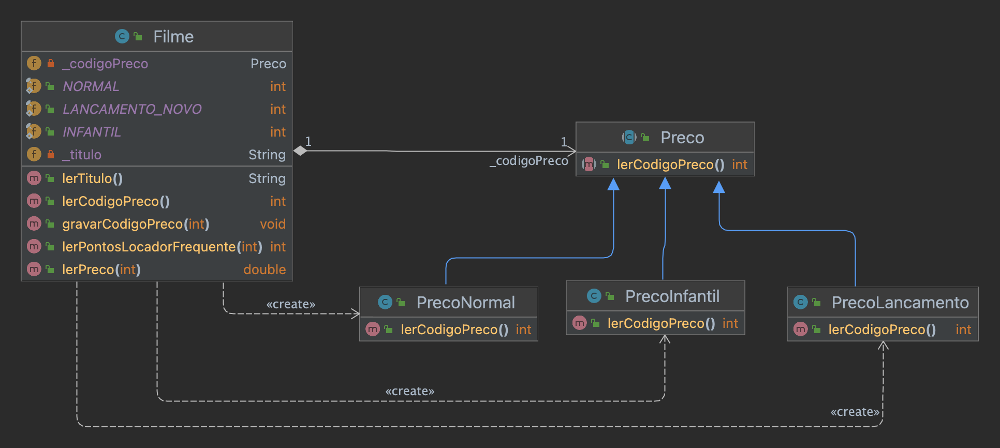
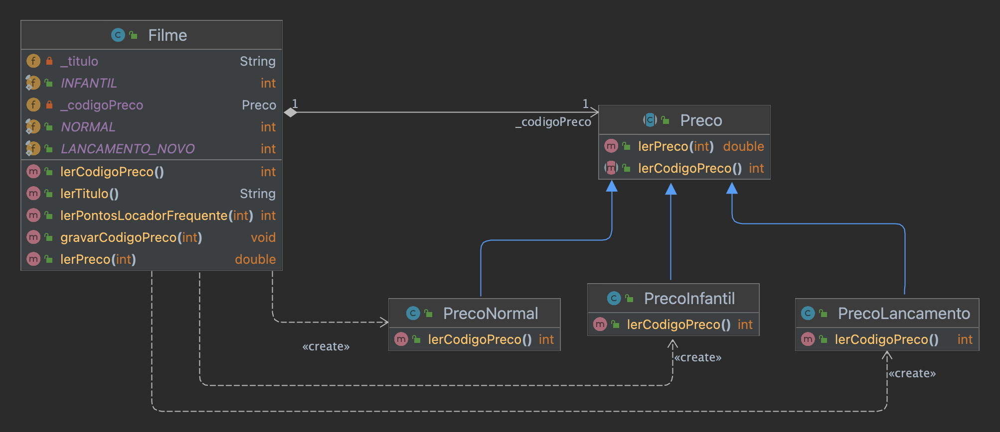
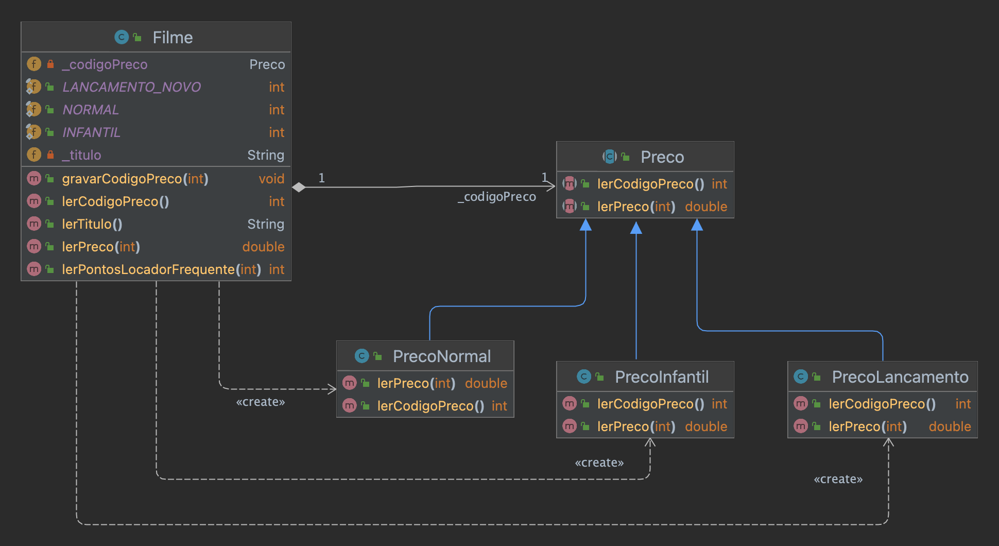
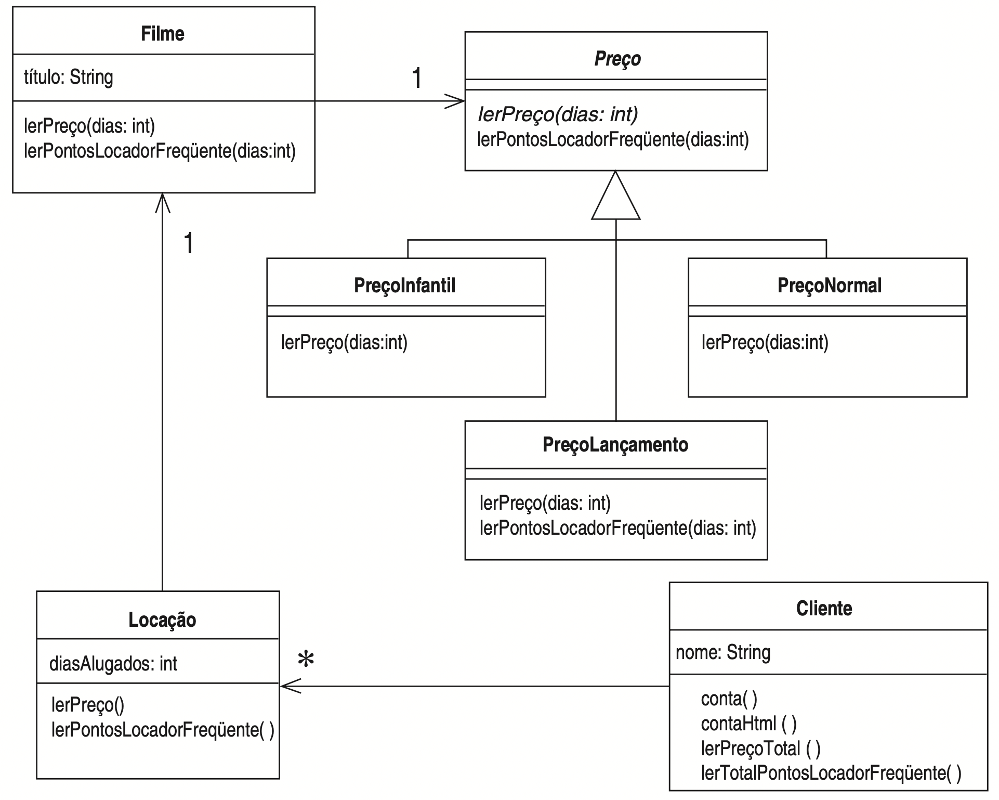
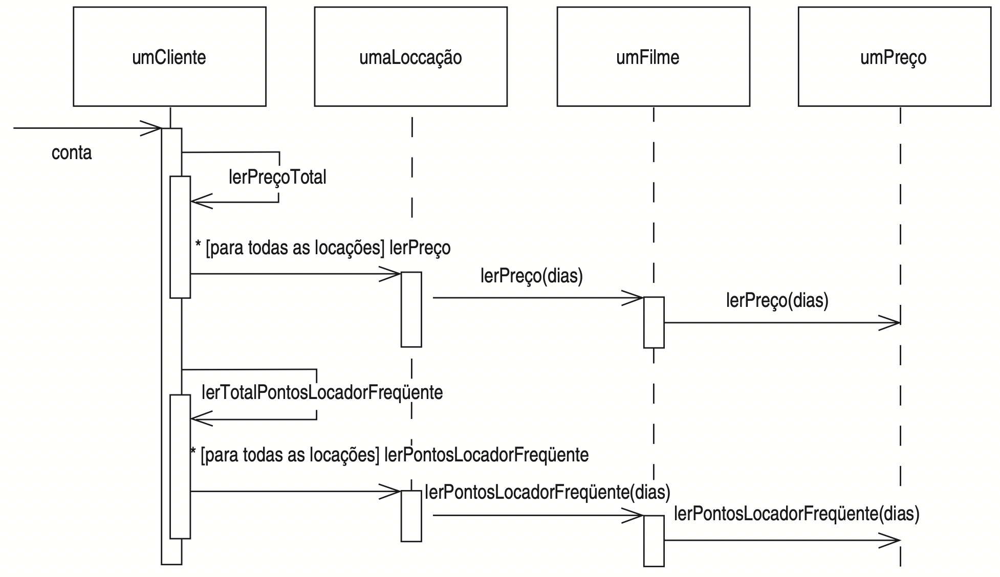
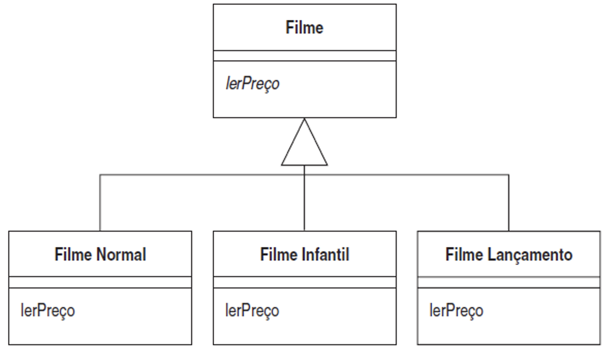

# Refactoring hands-on

Repository with source code of examples used in the refactoring hands-on taught by Rodrigo Martins Pagliares at UNIFAL-MG. There in toal 12 Maven projects in this repository (folder Source_Code). Starting at project 01, each project builds upon the previous one, allowing the students access to any part of this hands-on. Each project is configured to use JUnit 5 (via pom.xml) and can be imported to the IDE of your choice (I use IntelliJ Ultimate Edition).

During the hands-on, an initial functional project (## 01 - refactoring-hands-on) is evolved to implement a new requirement (generate a rental statement in HTML format). Since the initial project has a bad design, the developer decided to first refactor the existing code (versions 02 to 06 in this repository) before implementing the new requirement (version 07 of this repository). 

After finish implementing the requirement (code on ## 07 - refactoring-hands-on), the owner of the rental store notify us that they are planning to request an implementation of a new requirement (the inclusion of Musical Movies with its own price and rules for frequent renter points). This motivate us to keep refactoring the code (versions 08, 09.01, 09.02, 09.03, and 09.04 in this repository) to improve its design in order to ease accomodate this new requirements in a near future (This is implementation is left as exercise for the students during the hands-on).

In what follows, I present more details about the 12 maven projects found in the Source_Code folder of this repository.

## 01 - refactoring-hands-on

First version of the example to be evolved during the hands-on. Although fully functional, this version has a very poor object oriented design.

### UML Class Diagram:

    

### UML Sequence Diagram:

    

## 02 - refactoring-hands-on

Second version of the example. This version builds upon the first version by applying the refactoring Extract Method (creation of the method quantiaDe(Locacao umaLocacao) from the method conta()).

## 03 - refactoring-hands-on

Third version of the example. This version builds upon the second version by applying the refactorings Move Method and Rename Method (Moving the method quantiaDe(Locacao umaLocacao)from the class Cliente to the class Locacao. After moving, we rename the method to lerPreco).

### UML Class Diagram:

    

### UML Sequence Diagram:

    

## 04 - refactoring-hands-on

Fourth version of the example. In this example, we apply the refactoring Replace Temp with Query to the previous version of the code. This is a type of refactoring that is not alwasy feasible due performance issues, since it demands calling a method each time it is needed instead of calling it once and storing the result in a temp variable. For simple methods like the one used in this example,  performance is not an issue, but for some complex and time consuming methods, the reafactoring Replace Temp with Query would probably not be recommended.

## 05 - refactoring-hands-on

FIfth version of the example. In this version, we apply again the refactoring Extract Method and Move Method for the piece of code related to the calculation of frequent renter points. In other words, this example places the method lerPontosLocadorFrequente in the class Locacao.

### UML Class Diagram:

    

### UML Sequence Diagram:

    

## 06 - refactoring-hands-on

Sixth version of the example. In this example, we apply the refactoring Replace Temp with Query to the previous version of the code. Note that most refactorings reduce the amount of code, but this increases. This is due Java's inefficiency to generate an accumulator loop. Another important question is performance, since the previous code executed the while loop once and this new version runs 3 times. In situtions like that It is worth to use a Profiler to see if overall performance is really being affected.

The advantage in our example relies on separation of concerns, reducing the lines of code of the method conta() and make reuse easier of the methods to calculate the total amount of the rental and total amounto of renter points.

### UML Class Diagram:

    

### UML Sequence Diagram:

    

## 07 - refactoring-hands-on

Seventh version of the example. In this example, we finally decide to implement the new requirement of outputing the invoice with rental details in HTML format. During the hand-on in loco, I demonstrate this by using TDD.   

This example improves the implementation of the test case used to test the output to the console and now the html output by removing the white spaces within the expected and solution produced Strings ( \\s in the code below, means single character in UNICODE).

        assertEquals(saidaEsperadaHTMLSemEspacos, rodrigo.contaHTML().replaceAll("\\s", ""));

### UML Class Diagram:

    

## 08 - refactoring-hands-on

Eighth version of the example. In this example, we apply the refactoring Move Method twice: to move the methods lerPreco e lerPontosLocadorFrequente to the Filme class, keeping the original methods delegating to the new ones.

### UML Class Diagram:

    

## 09 - refactoring-hands-on

Nineth version of the example. This version is divided into 3 parts. 

### 09.1 - refactoring-hands-on

This version uses the design principle "Encapsulate what varies" in order to encapsulate the code of the movies in its own hierarchy (class Preco).

#### UML Class Diagram:

    

### 09.2 - refactoring-hands-on

This version uses the Move Method Refactoring. It moves the method lerPreco to Class Preco. a method with same signature still remains in class Filme, but it only delegates to the method lerPreco(int diasAlugados) on class Preco.

#### UML Class Diagram:

    

### 09.3 - refactoring-hands-on

This version applies the refactoring Replace Conditional with Polymorfism. The refactoring in this example gets rid of the switch on method lerPreco of class Preco (the method becomes abstract and each switch clause is moved to its respective subclass). After aplying the third refactoring, we derive a design pattern (State or Strategy, depending on how you are viewing the problem - family of algorithms to calculate rental amount our a state of a movie in a particular moment).

#### UML Class Diagram:

    

### 09.4 - refactoring-hands-on (FINAL VERSION ON THIS HANDS-ON)

This final version of this Hands-on. It uses (again) the Move Method Refactoring as an intermediary step towards the State/Strategy design patterns. 

This version It moves the method lerPontosLocadorFrequente(int diasAlugados) of class Filme to Class Preco. A method with same signature still remains in class Filme, but it only delegates to the method lerPontosLocadorFrequente(int diasAlugados) on class Preco. 

Since the implementation only differs for new releases (lançamentos), the method lerPontosLocadorFrequente(int diasAlugados) in the superclass is not abstract. It is overriden only in the PrecoNormal class.

I strongly suggest the students compare the UML Class and Sequence Diagrams of this version with the Diagrams of version 1 of this hands-on. The program does the same, but as you can see, with a completely new design. 

### UML Class Diagram:

    

### UML Sequence Diagram:

    

## Exercise 01 - refactoring-hands-on

In this exercise, the student must evolve version 09.4 of the software to incorporate one more type of movie: Musical. Musical films cost R$ 2.00 per rental with the right to keep the film for 2 days. For Musical type movies, the fine and frequent rental points are calculated as follows:
   - R$ 1.50 fine, per day of delay if delivered after 2 days.
   - Each rented movie counts 1 frequent renter point.

The solution for the exercise is presented at the Maven Project located at folder Source_Code/Exercise_Solution/01/refactoring-hands-on.

## Exercise 02 - refactoring-hands-on

In this exercise, the student must evolve version 8 of the software to implement an alternative solution (different from solutions for versions 09.1, 09.2, 09.3, and 09.4). In this exercise, the student must implement the design shown in the UML class diagram below. 

### UML Class Diagram:

    

Important: This solution is worse than the solution provided in examples 09.1, 09.2, 09.3, and 09.4. Why?
